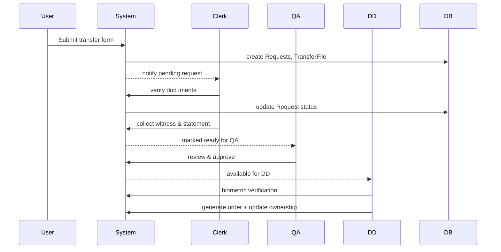
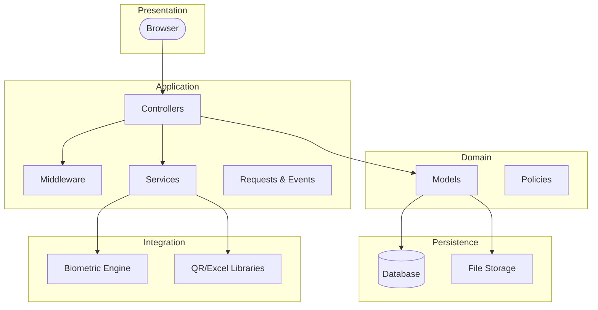

# System Architecture Overview

This document describes the complete software architecture for the MDHA (Mangla Dam Housing Authority) Property Transfer Management System. It is intended to guide developers, architects, and stakeholders through each component, their responsibilities, and how they interact.

> **Note:** Deployment/infrastructure (servers, network, cloud) is outside the scope per requirements.

---

## 1. Architectural Style

The system follows a **layered architecture** with clear separation between presentation, application logic, domain models, persistence, and integration layers. Core technology is Laravel (MVC framework) combined with Blade templates, Tailwind CSS, and Alpine.js for the frontend.

### Layers

1. **Presentation Layer** – UI rendered by Laravel views plus client-side scripts.
2. **Application Layer** – Controllers, middleware, service classes, requests, events.
3. **Domain Layer** – Eloquent models, business rules, entity relationships.
4. **Persistence Layer** – Relational database and file storage abstractions.
5. **Integration Layer** – External services and third-party libraries.

Each layer interacts only with the layer directly below it, keeping dependencies unidirectional.

---

## 2. Component Breakdown

### 2.1 Presentation
- **Blade Views**: Located under `resources/views`; modular structure per role (property, user, clerk, dd, qa, desk).
- **Assets**: `resources/js` (Alpine.js behaviors, Vite entrypoints), `resources/css` (Tailwind directives).
- **Client Interactions**: AJAX calls using Axios (bundled with Laravel), form submissions, file uploads, biometric WebAuthn.

### 2.2 Application
- **Controllers**: Handle HTTP requests, apply validation, coordinate services and models.
  - `PropertyController`, `UsersController`, `ClerkController`, `DDController`, `QAController`, `FrontDeskController`, `RoleController`, `UserController`, `CaptchaController`.
- **Middleware**: Authentication, role checks, town-scoping, CSRF.
- **Form Request Classes**: Validation rules for various forms (`StorePropertyRequest`, `TransferFileRequest`, etc.).
- **Jobs & Events**: (e.g., `TransferRequestCreated` event, `SendNotificationJob`).
- **Services**: Business-specific helpers such as `BiometricService`, `DocumentGenerator`, `AppointmentManager`.

### 2.3 Domain
- **Models**: Represent database tables and encapsulate domain logic.
  - `User`, `Property`, `Inheritance`, `Requests`, `TransferFile`, `Witness`, `Representative`, `PropertyStatement`, `Appointment`, `Schedule`, `Biometric`, etc.
- **Relationships**: Defined using Eloquent `hasMany`, `belongsTo`, `belongsToMany`, and custom scopes for owner filtering and status checks.
- **Business Rules**: Implemented within model methods (e.g., `Property::transferOwnership()`), or via dedicated service classes.
- **Policies**: ACLs (optional) placed in `app/Policies` to enforce per-model permissions.

### 2.4 Persistence
- **Database Schema**: Managed via migrations in `database/migrations`. Key tables mirror the models above.
- **Eloquent ORM**: Models are active records; queries use query builder and scopes.
- **Transactions**: Critical operations use `DB::transaction()` for atomicity.
- **File Storage**: Laravel `Storage` facade configured for local disk. All uploaded documents stored under `/public/uploads` with unique filenames.

### 2.5 Integration
- **Biometric Engine**: External library wrapped by `BiometricService`; interacts with fingerprint templates, matching, and verification.
- **QR Generator**: `simple-qrcode` used to create codes for transfer orders.
- **Excel Exporter**: `simplexlsxgen` for QA data exports.
- **HTTP Client (Guzzle)**: Potentially used for CNIC validation via API.

---

## 3. Data Flow Scenarios

### 3.1 Property Registration
```
User -> PropertyController@store
  validate -> Temp tables -> attachments uploaded
  -> DB transaction -> Property + Attchement records
```
- Temporary storage allows multi-page forms.
- After creation, temp data is destroyed.

### 3.2 Transfer Request Lifecycle
```
User submits request -> Requests + TransferFile created -> event queued
-> ClerkController picks up request -> verifies -> adds witnesses/statements
-> QA reviews -> DD verifies biometrics -> DocumentGenerator creates order
-> Inheritance updated -> TransferedProperty record inserted
```
» Each step updates status fields in the `requests` table and optionally triggers events (notifications, logs).

Sequence diagram (Mermaid):



---

## 4. Architecture Diagrams

### 4.1 Logical Component Diagram


### 4.2 Deployment Note (omitted as requested)

---

## 5. Component Interfaces

| Component | Responsibilities | Interface/Methods |
|-----------|------------------|------------------|
| PropertyController | Handle property CRUD | `create()`, `store()`, `edit()` ... |
| BiometricService | Wraps external biometric API | `registerTemplate()`, `verify()` |
| DocumentGenerator | Creates PDFs/QR codes | `generateTransferOrder()` |
| AppointmentManager | Enforces schedule limits | `book()`, `cancel()`, `hasSlot()` |
| Models (Inheritance) | Ownership rules | `transferTo($user)` |

---

## 6. Security Considerations

- Encrypt biometric and CNIC data using Laravel's encryption helpers.
- Validate all uploads against allowed mime types and scan for malware (integration planned).
- Use `spatie/laravel-permission` for robust RBAC plus policies to guard data at model level.

---

## 7. Extensibility Points

- **Modular Controllers**: Add new transfer types by extending `TransferFile` logic and templates.
- **Storage Adapter**: Swap `Storage` disk to S3 or network share by changing config.
- **Biometric Provider**: New engine implementation can be swapped via service contract.
- **Reporting**: Add new dashboards using existing analytics queries and export services.

---

## 8. Glossary

- **CNIC**: Computerized National Identity Card (Pakistan).
- **Nakle Bala**: Official property transfer order.
- **DEO**: Data Entry Operator (record clerk role).

---

This completes the full architecture description for the MDHA project. Stick to this guide when implementing new features to ensure consistency and maintainability.
